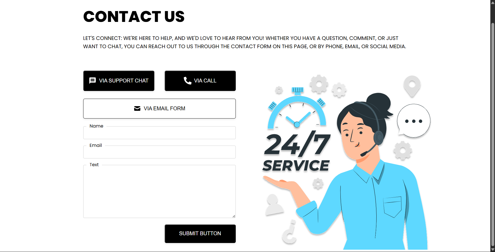

# React Contact Form 🚀

A simple and responsive contact form built using **ReactJS**.  
This project shows how to handle forms, state, and submission in React.

---

## 📸 Screenshot

](./public/images/contact.svg)

---

## ✨ Features

- 📬 Submit Name, Email & Message
- ✅ State management using React Hooks
- 🎨 Clean and modern CSS styling
- 📞 Multiple contact options (Chat, Call, Email)

## 🚀 Getting Started

1️⃣ Clone this repository:
```bash
git clone then link..
2️⃣ Install dependencies:
```bash
npm install
3️⃣ Run the project:
```
npm run dev

📃 License
This project is licensed for learning and practice.
Feel free to fork and modify!
